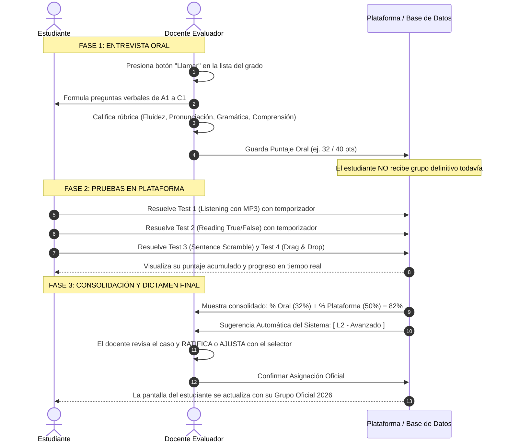

# PLAN MAESTRO DE EVALUACIÓN DIAGNÓSTICA Y UBICACIÓN DE INGLÉS 2026
**Colegio Salesiano San José · Proyecto "Get Involved" (Macmillan)**  
*Documento de Trabajo para Revisión y Visto Bueno del Equipo Docente de Inglés*

---

## 1. Fundamento y Filosofía de la Evaluación

El propósito central de este sistema es ubicar con **justicia, rigor pedagógico y transparencia** a cada estudiante en su grupo correspondiente de inglés (**Básico**, **Intermedio** o **Avanzado**) para el próximo ciclo escolar **2026**.

### Principio Rector Universal
> **"Todos los estudiantes —sin importar su grado escolar actual ni el grupo en que están matriculados— presentan ejercicios que abarcan todo el espectro de niveles (A1, A2, B1, B2 y C1)."**

Este principio garantiza un diagnóstico real:
* Evita dar por sentado que un alumno de grado superior domina los fundamentos (detecta vacíos en A1/A2).
* Permite que un alumno de grado inicial con alto dominio pueda destacar y ser ubicado en el grupo avanzado (A2/B1).

---

## 2. Los Dos Grandes Pilares de Evaluación

La evaluación global del alumno se compone de dos pilares complementarios. Los porcentajes de ponderación sobre el 100% son **100% configurables por los docentes**:

```
┌────────────────────────────────────────────────────────────────────────────────────────┐
│                        EVALUACIÓN GLOBAL DEL ESTUDIANTE (100%)                         │
├───────────────────────────────────────────┬────────────────────────────────────────────┤
│  🎙️ PILAR 1: ENTREVISTA ORAL INDIVIDUAL   │  💻 PILAR 2: PRUEBAS EN PLATAFORMA         │
│     Ponderación propuesta: 40%            │     Ponderación propuesta: 60%             │
│     • Conducida en vivo por el docente    │     • Batería de pruebas interactivas      │
│     • Preguntas progresivas A1 a C1       │     • Con temporizador por test            │
│     • Rúbrica oficial de 5 criterios      │     • Listening con audio MP3 real         │
│     • El docente decide hasta dónde avanza│     • Reading True/False, Scramble y Cloze │
│     • Genera un PUNTAJE ORAL (no grupo)   │     • Genera PUNTAJE ESCRITO/MULTIMEDIA    │
└───────────────────────────────────────────┴────────────────────────────────────────────┘
```

> **Flexibilidad Docente:** La distribución inicial sugerida es **40% Oral y 60% Plataforma**. Si el departamento de inglés prefiere **50% Oral / 50% Plataforma**, o cualquier otra proporción, el panel de control permite ajustar los porcentajes en cualquier momento y el sistema recalcula automáticamente.

---

## 3. Matriz Oficial de Grados y Grupos Destino

La prueba diagnostica al estudiante para su **grado de destino (el grado al que pasará en el ciclo 2026)**:

| Grado Actual (2025) | Grado Destino (2026) | Nivel BÁSICO *(Inicial / Refuerzo)* | Nivel INTERMEDIO *(Estándar / Consolidado)* | Nivel AVANZADO *(Adelantado / Exigente)* |
| :---: | :---: | :---: | :---: | :---: |
| **6° Grado** | **➔ 7° Grado** | **L1-A** *(Libro 1 Inicial)* | **L1-B** *(Libro 1 Regular)* | **L2** *(Libro 2 Adelantado)* |
| **7° Grado** | **➔ 8° Grado** | **L2-A** *(Libro 2 Inicial)* | **L2-B** *(Libro 2 Regular)* | **L3** *(Libro 3 Adelantado)* |
| **8° Grado** | **➔ 9° Grado** | **L2-A** *(Libro 2 Nivelación)* | **L2-B** *(Libro 2 Estándar)* | **L3** *(Libro 3 Adelantado)* |
| **9° Grado** | **➔ 1° Bachillerato (10°)** | **L3-A** *(Libro 3 Básico)* | **L3-B** *(Libro 3 Regular)* | **L4-A** *(Libro 4 Avanzado)* |
| **10° Grado** | **➔ 2° Bachillerato (11°)** | — | **L4-A** *(Libro 4 Consolidado)* | **L5-A** *(Libro 5 / Nivel C1)* |
| **11° Técnico** | **➔ 3° Bachillerato Técnico (12°)** | **L4-A** *(Libro 4)* | **L5-A** *(Libro 5 Regular)* | **L5-B** *(Libro 5 / C1+ Avanzado)* |

> **Directriz Institucional de Asignación:**
> * **La Matriz como tal es fija:** Define el estándar institucional de libros y grupos por grado (área administrativa de referencia y asignación). No debe alterarse para no desfasar la estructura escolar.
> * **11° Bachillerato General:** Culminan su ciclo académico de inglés.
> * **11° Bachillerato Técnico:** Se promueven a 12° Técnico con continuidad de libro.

---

## 4. Catálogo de Herramientas Interactivas en la Plataforma

Para la parte de la plataforma no se aplica un solo examen monótono, sino una **suite modular de herramientas interactivas** basadas estrictamente en los materiales oficiales del repositorio (`material_evaluaciones/`):

### 🎧 Herramienta 1: Comprensión Auditiva (Listening con Audio MP3)
* **Dinámica:** La plataforma cuenta con un reproductor de audio integrado (play, pausa, barra de reproducción y volumen). El estudiante escucha el audio auténtico y responde preguntas de comprensión.
* **Material Oficial Integrado:**
  * **Nivel A1:** Audio `A1_first_day_at_schoolA1.mp3` (Diálogo de registro escolar, deletreo de nombres *Jing Wang*, edad, salón *3B*, profesor *Mr. Smith*).
  * **Nivel A2:** Audio `A2_giving_directionsA2.mp3` (Instrucciones de ubicación: *go straight on*, *past the library*, *turn left at the roundabout*).

### 🧩 Herramienta 2: Ordenar Oraciones (Sentence Scramble)
* **Dinámica:** Las palabras de una estructura gramatical aparecen en fichas desordenadas. El alumno hace clic o las arrastra en el orden sintáctico correcto (Sujeto + Auxiliar + Verbo + Complemento).
* **Material Oficial Integrado:**
  * Preguntas de rutina en Presente Simple (A1), oraciones con *used to* y pasado simple (A2), primer/segundo condicional (B1), voz pasiva e inversiones (B2/C1).

### ✅ Herramienta 3: Falso o Verdadero con Lectura (True / False Reading)
* **Dinámica:** El estudiante visualiza un texto o infografía auténtica y evalúa una serie de afirmaciones seleccionando `[ True ]` o `[ False ]`.
* **Material Oficial Integrado:**
  * **A1:** Póster `the_school_library_-_poster_A1.pdf` (Reglas y horarios de la biblioteca escolar).
  * **A2:** Artículo `films_and_entertainment_-_article_A2.pdf` (Géneros de cine y sinopsis).
  * **B2:** Texto `fomo_-_text_B2.pdf` (Artículo sobre el fenómeno *Fear Of Missing Out* y uso de redes).
  * **C1:** Texto `do_you_have_the_right_mindset_-_textC1.pdf` (Psicología de Carol Dweck: Mentalidad fija vs de crecimiento).

### 📝 Herramienta 4: Trasladar Palabras / Completar Huecos (Drag & Drop Fill-in)
* **Dinámica:** Un párrafo con espacios en blanco `[ ___ ]` y un banco de palabras disponibles. El alumno arrastra o selecciona la opción precisa para cada contexto.
* **Material Oficial Integrado:**
  * Ejercicios de uso del lenguaje extraídos de las guías de viaje de B1 (`travel_guide_-_guide_B1.pdf`) y vocabulario contextual de B2/C1.

### 🔗 Herramienta 5: Emparejamiento de Conceptos (Matching Pairs)
* **Dinámica:** Dos columnas donde el estudiante relaciona definiciones, sinónimos o reglas con sus conceptos correspondientes mediante líneas visuales.

---

## 5. Temporizador Configurable por Test ⏱️

Cada test creado por los docentes en la plataforma cuenta con su propio control de tiempo para garantizar honestidad y agilidad:

1. **Configuración Docente:**
   * El docente define los **minutos permitidos** para cada test (ej. `10 min`, `15 min`, `20 min`) o selecciona la opción `Sin límite de tiempo`.
2. **Visualización para el Alumno:**
   * Un reloj regresivo visible en todo momento con cambio de color según el tiempo restante:
     * 🟢 **Verde:** Más del 25% del tiempo disponible.
     * 🟡 **Amarillo:** Menos del 25% del tiempo restante.
     * 🔴 **Rojo pulsante:** Últimos 2 minutos con alerta visual discreta.
3. **Autoguardado al expirar:**
   * Si el cronómetro llega a `00:00`, el sistema automáticamente envía y califica las respuestas que el alumno logró responder, evitando pérdidas de información.

---

## 6. Ejemplo de Distribución Modular de Tests en la Plataforma

Propuesta sugerida para la batería de pruebas:

| Test | Herramienta Interactiva | Material Oficial de Respaldo | Tiempo Límite Sugerido | Ponderación (%) |
| :--- | :--- | :--- | :---: | :---: |
| **Test 1** | 🎧 **Listening:** Registro y Direcciones | Audios A1 (`first_day`) y A2 (`giving_directions`) | 12 min | **20%** |
| **Test 2** | ✅ **Reading True/False:** Reglas y Artículos | Textos A1 (*Library*), A2 (*Films*) y B2 (*FOMO*) | 15 min | **20%** |
| **Test 3** | 🧩 **Sentence Scramble:** Sintaxis y Tiempos | Reactivos de Get Involved Books 1 a 5 | 10 min | **10%** |
| **Test 4** | 📝 **Drag & Drop:** Use of English y Vocabulario | Textos B1 (*Travel*) y C1 (*Mindset*) | 15 min | **10%** |
| **Oral** | 🎙️ **Entrevista Oral Individual con Docente** | Banco oficial de preguntas A1 a C1 con rúbrica | En vivo | **40%** |
| **TOTAL** | — | — | **52 min** | **100%** |

*(Tanto los tiempos como las ponderaciones son 100% modificables por el equipo docente).*

---

## 7. Umbrales de Aciertos Sugeridos (Configurables por Grado)

Sobre la nota global acumulada (0% a 100%), el sistema aplica los siguientes rangos para formular la **Sugerencia Automática de Nivel**:

| Nivel Pedagógico | Rango de Porcentaje Sugerido | Enfoque Pedagógico |
| :---: | :---: | :--- |
| **BÁSICO**<br>*(L1-A, L2-A, L3-A)* | **0% a 45%** | Requiere acompañamiento guiado y refuerzo en bases gramaticales y vocabulario inicial. |
| **INTERMEDIO**<br>*(L1-B, L2-B, L3-B)* | **46% a 74%** | Comprensión y fluidez estándar adecuada para cursar el programa regular de su grado. |
| **AVANZADO**<br>*(L2, L3, L4-A, L5-A)* | **75% a 100%** | Dominio sobresaliente; preparado para cursar el libro de nivel superior con mayor exigencia. |

> ⚙️ **Control total del docente:** El panel docente incluye una sección donde los profesores pueden ajustar estos cortes (por ejemplo, subir el corte de Avanzado al 80% o ajustar Básico al 50%).

---

## 8. Flujo de Trabajo y Toma de Decisión Humana ("El Docente Decide")

El sistema apoya con analítica, pero la decisión final siempre es del docente:



---

## 9. Experiencia y Transparencia para el Estudiante

En el portal del alumno ([StudentGamifiedExam.jsx](file:///c:/englishlevel/src/components/student/StudentGamifiedExam.jsx)):
1. **Ficha Informativa:** Nombre, carnet, grado actual y grado al que aplica (ej. *"Candidato a 7° Grado"*).
2. **Panel de Pruebas:**
   * Cada prueba muestra su estado (`Pendiente`, `En curso`, `Completada`), su ponderación (%) y su tiempo límite.
   * La entrevista oral indica si ya fue calificada por el docente con el puntaje obtenido.
3. **Barra de Progreso Acumulado:** Un gráfico de progreso transparente que le muestra su avance total hacia el 100%.

---

## 10. Hoja de Revisión y Visto Bueno del Equipo Docente

Para ser completado por los docentes de inglés del Colegio Salesiano San José:

| Pregunta de Validación | Respuesta Docente | Observaciones / Ajustes Propuestos |
| :--- | :---: | :--- |
| **1. Ponderación Global:** ¿Aprueban 40% Oral y 60% Plataforma, o prefieren otra distribución (ej. 50/50)? | `[  ] Sí  [  ] Modificar` | |
| **2. Batería de Tests:** ¿Están de acuerdo con los 4 tipos de pruebas interactivas (Listening, True/False, Scramble, Drag & Drop)? | `[  ] Sí  [  ] Modificar` | |
| **3. Temporizador:** ¿Consideran adecuados los tiempos propuestos de 10 a 15 minutos por prueba? | `[  ] Sí  [  ] Modificar` | |
| **4. Umbrales de Corte:** ¿Aprueban los rangos de 0-45% (Básico), 46-74% (Intermedio) y 75-100% (Avanzado)? | `[  ] Sí  [  ] Modificar` | |
| **5. Criterio Docente:** ¿Están de acuerdo en que el sistema sugiera el nivel automáticamente pero el docente tenga el selector para confirmar o cambiar? | `[  ] Sí  [  ] Modificar` | |

### Firmas de Revisión:
* **Docente Evaluador 1:** ___________________________________  Fecha: ____________
* **Docente Evaluador 2:** ___________________________________  Fecha: ____________
* **Docente Evaluador 3:** ___________________________________  Fecha: ____________
* **Coordinación de Inglés:** _______________________________  Fecha: ____________
